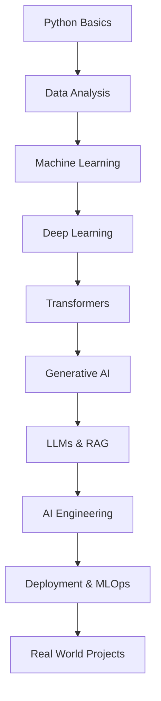

# 🚀 AI & Machine Learning Roadmap

 

 
 

A complete modern roadmap for mastering Artificial Intelligence, Machine Learning, Deep Learning, and Generative AI with practical projects and real-world AI engineering skills.

---

## Authors

- [@RuhonBorah](https://github.com/uixPhuke)

## 🚀 About Me
I'm a Full Stack Developer specializing in the MERN stack, with a strong interest in building scalable and interactive web applications. I enjoy working across both frontend and backend systems to create smooth and efficient user experiences.
Currently, I'm expanding my skills in Artificial Intelligence and Machine Learning, exploring areas such as Deep Learning, Generative AI, LLMs, and AI-powered application development to combine modern web technologies with intelligent systems.

## 🔗 Links

# 🌟 About This Repository

This repository is a structured roadmap designed to help developers and students learn modern AI technologies step by step.

From Python fundamentals to Machine Learning, Deep Learning, LLMs, Generative AI, deployment, and production-ready AI systems — everything is organized in a practical learning flow.

---

# 🧠 Learning Roadmap

---

# 🧩 1. Python & Data Foundations

### ✨ Core Python
- Variables & Data Types
- Operators
- Loops & Conditions
- Functions & Lambda
- Modules & Packages
- Exception Handling
- File Handling
- JSON

### ✨ Data Structures
- Lists
- Tuples
- Dictionaries
- Sets
- List Comprehensions

### ✨ OOP Concepts
- Classes & Objects
- Inheritance
- Polymorphism
- Encapsulation
- Abstraction

### ✨ Data Analysis
- NumPy
- Pandas
- Data Cleaning
- EDA
- Matplotlib
- Seaborn

---

# 🤖 2. Machine Learning

### ✨ Algorithms
- Linear Regression
- Logistic Regression
- Decision Trees
- Random Forest
- KNN
- SVM
- Naive Bayes

### ✨ Tools
- Scikit-learn
- Kaggle

---

# 🧠 3. Deep Learning

### ✨ Architectures
- ANN
- CNN
- RNN
- LSTM
- Transformers

### ✨ Frameworks
- TensorFlow
- Keras
- PyTorch

---

# 🤯 4. Generative AI

### ✨ Core Topics
- LLMs
- NLP
- Prompt Engineering
- Embeddings
- RAG Systems
- AI Agents

### ✨ Platforms
- OpenAI API
- Hugging Face
- LangChain

---

# 🏗️ 5. AI Engineering

### ✨ Backend
- Flask
- FastAPI
- REST APIs

### ✨ Deployment
- Docker
- Kubernetes
- GitHub Actions

---

# 💼 6. Projects

- House Price Prediction
- Spam Detection
- AI Chatbot
- PDF QA System
- Image Classification
- Recommendation Systems

---

# 🛠️ Tech Stack

---

# ⭐ Support

If you found this repository helpful:

🌟 Star the repository  
🍴 Fork the project  
📢 Share with others  

---

